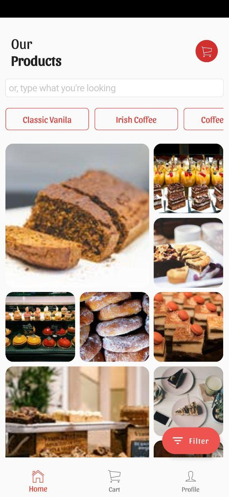
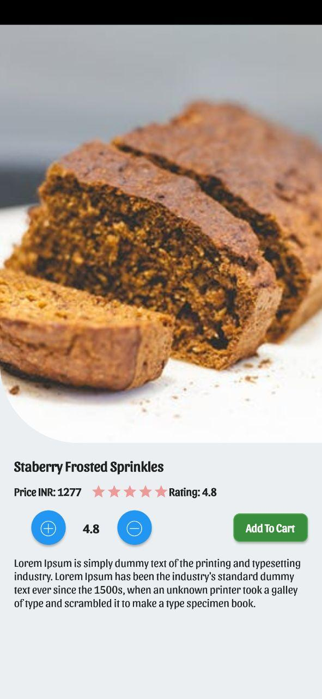
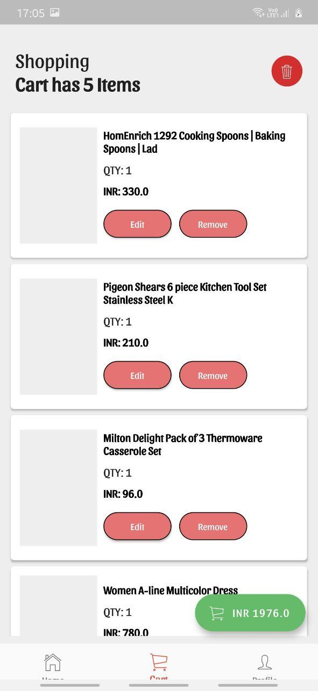
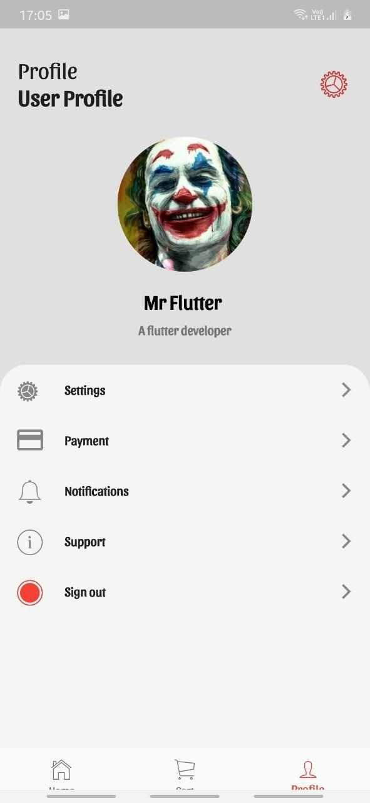

# CakeCornerApplication

A new Flutter project.

## Getting Started

This project is a starting point for a Flutter application.

- [ishaileshmishra: Cake products Application](https://flutter.dev/docs/get-started/codelab)
- [Cookbook: Cake Selling Application](https://flutter.dev/docs/cookbook)

Application might be sluggy in the debug mode

[APP_DEBUG](https://github.com/ishaileshmishra/cake-app/blob/master/assets/app-debug.apk?raw=true), Suggested to download debug mode app.

[APP_RELEASE](https://github.com/ishaileshmishra/cake-app/blob/master/assets/app-release.apk?raw=true)

   